# ØMQ : теоретические основы #

Эта [статья][ORIG] написана в качестве вклада в обсуждение в рамка Рабочей группы по SP (Scalable Protocols) в 2011 году.

- [ØMQ : теоретические основы](#%C3%B8mq--%D1%82%D0%B5%D0%BE%D1%80%D0%B5%D1%82%D0%B8%D1%87%D0%B5%D1%81%D0%BA%D0%B8%D0%B5-%D0%BE%D1%81%D0%BD%D0%BE%D0%B2%D1%8B)
  - [Введение](#%D0%B2%D0%B2%D0%B5%D0%B4%D0%B5%D0%BD%D0%B8%D0%B5)
  - [Топологии](#%D1%82%D0%BE%D0%BF%D0%BE%D0%BB%D0%BE%D0%B3%D0%B8%D0%B8)
  - [Транспорт](#%D1%82%D1%80%D0%B0%D0%BD%D1%81%D0%BF%D0%BE%D1%80%D1%82)
  - [Построение топологии vs. Маршрутизация сообщений](#%D0%BF%D0%BE%D1%81%D1%82%D1%80%D0%BE%D0%B5%D0%BD%D0%B8%D0%B5-%D1%82%D0%BE%D0%BF%D0%BE%D0%BB%D0%BE%D0%B3%D0%B8%D0%B8-vs-%D0%BC%D0%B0%D1%80%D1%88%D1%80%D1%83%D1%82%D0%B8%D0%B7%D0%B0%D1%86%D0%B8%D1%8F-%D1%81%D0%BE%D0%BE%D0%B1%D1%89%D0%B5%D0%BD%D0%B8%D0%B9)
  - [Шаблоны обмена данными с помощью сообщений](#%D1%88%D0%B0%D0%B1%D0%BB%D0%BE%D0%BD%D1%8B-%D0%BE%D0%B1%D0%BC%D0%B5%D0%BD%D0%B0-%D0%B4%D0%B0%D0%BD%D0%BD%D1%8B%D0%BC%D0%B8-%D1%81-%D0%BF%D0%BE%D0%BC%D0%BE%D1%89%D1%8C%D1%8E-%D1%81%D0%BE%D0%BE%D0%B1%D1%89%D0%B5%D0%BD%D0%B8%D0%B9)
  - [Прыг-скок или Из-конца-в-конец](#%D0%BF%D1%80%D1%8B%D0%B3-%D1%81%D0%BA%D0%BE%D0%BA-%D0%B8%D0%BB%D0%B8-%D0%B8%D0%B7-%D0%BA%D0%BE%D0%BD%D1%86%D0%B0-%D0%B2-%D0%BA%D0%BE%D0%BD%D0%B5%D1%86)
  - [Разрешение имен](#%D1%80%D0%B0%D0%B7%D1%80%D0%B5%D1%88%D0%B5%D0%BD%D0%B8%D0%B5-%D0%B8%D0%BC%D0%B5%D0%BD)
  - [Приложение: Архитектурные принципы](#%D0%BF%D1%80%D0%B8%D0%BB%D0%BE%D0%B6%D0%B5%D0%BD%D0%B8%D0%B5-%D0%B0%D1%80%D1%85%D0%B8%D1%82%D0%B5%D0%BA%D1%82%D1%83%D1%80%D0%BD%D1%8B%D0%B5-%D0%BF%D1%80%D0%B8%D0%BD%D1%86%D0%B8%D0%BF%D1%8B)
    - [Принцип единообразия](#%D0%BF%D1%80%D0%B8%D0%BD%D1%86%D0%B8%D0%BF-%D0%B5%D0%B4%D0%B8%D0%BD%D0%BE%D0%BE%D0%B1%D1%80%D0%B0%D0%B7%D0%B8%D1%8F)
    - [Принцип масштабируемости](#%D0%BF%D1%80%D0%B8%D0%BD%D1%86%D0%B8%D0%BF-%D0%BC%D0%B0%D1%81%D1%88%D1%82%D0%B0%D0%B1%D0%B8%D1%80%D1%83%D0%B5%D0%BC%D0%BE%D1%81%D1%82%D0%B8)
    - [Принцип вставки](#%D0%BF%D1%80%D0%B8%D0%BD%D1%86%D0%B8%D0%BF-%D0%B2%D1%81%D1%82%D0%B0%D0%B2%D0%BA%D0%B8)
  - [Заключение](#%D0%B7%D0%B0%D0%BA%D0%BB%D1%8E%D1%87%D0%B5%D0%BD%D0%B8%D0%B5)

## Введение ##

В отличие от остальных (централизованных) систем обмена сообщениями, которые основаны на понятной теоретической базе, практически отсутствуют материалы по распределенным системам обмена сообщениями в общем и ØMQ в частности, к которым мог бы обратиться заинтересованный читатель.

Цель этой статьи - описать базовые концепции архитектуры ØMQ, как они сочетаются и каковы причины их устройства именно в такой, а не иной форме.

## Топологии ##

*Топология* - это базовый концепт в ØMQ. Пока он не станет понятен, остальные концепции будут казаться странными и тяжелыми для понимания, и даже неверно спроектированными.

В упрощенной форме мы можем определить топологию как набор приложений работающих в пределах одного аспекта бизнес-логики.

**Пример**: Представьте себе сервис преобразования изображений, позволяющий менять размер и разрешение. Все приложения, осуществляющие собственно преобразование, использующие его результаты, промежуточные узлы, такие как балансировщики нагрузки - все они образуют топологию.

Технически, топология обладает следующими свойствами:
  1. Топология - это граф, узлами которого являются приложения, а ребрами - каналы для обмена данными между ними.
  2. Для всех приложений согласован единый протокол для связи бизнес-логики.
  3. Указанный выше граф является связным, то есть любые два узла соединены напрямую или опосредованно

**Первое свойство** вполне очевидно. Только стоит отметить, что термин *канал* используется сознательно вместо *соединения*, с целью передать, что модель описывает и ситуацию, когда используются протоколы без соединений, такие как IP multicast или UDP.

**Второе свойство** описывает то, что все приложения, входящие в топологию, согласовали
  * какие сообщения будут передаваться (напр. "изменить размер данного изображения" или "это изображение измененного размера");
  * возможную последовательность сообщений (реализовано в виде машины состояний в приложениях);
  * фактический формат данных (как закодирован цвет изображения? RGB? CMYK?) и т.д.
  
**Третье свойство** передает то, что если имеется 2 развернутых системы с в точности повторяющейся бизнес-логикой (напр. две компании), они или образуют две топологии или соединены взаимно каналами данных.

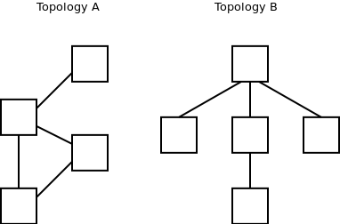

Для того чтобы интуитивно ухватить понимание концепта топологии, необходимо, что указанный концепт нечеткий (нестрогий).

Он *нечеткий* в том же смысле, в каком является *нечетким* концепт класса в ООП. Формально класс определяется как наборы данных и методов, однако, ни одно определение не описывает строго *какая именно* часть предметной области должны быть оформлена как класс, а какая - нет. Программист самостоятельно принимает решение о том, какие бизнес-концепции будут упакованы в конкретный класс, а какие - нет. Программист может ошибиться в равной степени как упаковав все в один класс, де-факто отказавшись от объектно-ориентированного подхода, так и разбив логику на мириады маленьких классов, превратив программу в непостижимый клубок взаимных зависимостей.

Таким же образом, нет единственно верного пути разбить бизнес-логику на топологии. Единственное правило - топология должна быть атомарной единицей масштабирования. Вы можете масштабировать конкретную топологию целиком, но вы не можете масштабировать только один её аспект в отдельности. Таким образом, если вы предполагаете необходимость масштабирования функциональности *A* отдельно от функциональности *B*, вам следует разделять их топологии.

Давайте проиллюстрируем это конкретным примером:

В нашем приложении обработки изображений есть 2 базовые функции: изменение размера и настройка яркости. Мы можем создать единую топологию для них или две раздельных.

**В первом** случае мы определим протокол для передачи информации об интересующей нас функциональности. Скажем, первый байт сообщения будет "1" для изменения размера и "2" для настройки яркости. Мы должны учесть тот факт, что такая архитектура приведет к сильной сцепленности обеих функций. Если в последующем мы решим добавить больше обрабатывающих узлов в нашу систему, каждый из них должен будет реализовывать обе функции.

**Во втором** случае обе функции разделены. Нет необходимости в специальном поле в формате обмена, так как все запросы в каждой из топологий будут касаться только одной функции. При такой архитектуре мы можем масштабировать каждую из функций отдельно от другой. В случае, допустим, разработки специализированной [FPGA][FPGA] для изменения размера изображений, мы сможем просто подключить их к соответствующей топологии, без влияния на вторую. Это может быть проиллюстрировано следующим рисунком:

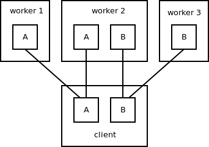

Обратите внимание, что клиентское приложение может запрашивать обе функции через соответствующие топологии, а равно обработчики могут как выполнять только одну из них, так и обе.

Наконец стоит отметить, что топология, будучи отделенной от других, может быть связана с конкретным свойством нижележащего транспорта, таким как TCP порт. Это позволяет основывать поведение нижележащей сети на критериях бизнес-логики и дает возможность, например, замерять пропускную способность, потребляемую конкретной топологией (в данном конкретном примере сравнивать функционал изменения размера и изменения яркости изображения). Появляется возможность выделять полосу для конкретной топологии, например ускорять один функционал ценой скорости другого.

## Транспорт ##

Часто требуется организовать обмен сообщениями поверх разнородного транспорта в дополнение к TCP, таких как [InfiniBand][INFINIBAND] (по соображениям производительности), IP multicast (оптимизация используемой пропускной способности) или [SCTP][SCTP] ([multihoming][MULTIHOMING], [heartbeats][HEARTBEAT]).

Наивный подход состоит в том, чтобы начав с использования TCP, попутно добавив то, чего в нем не достает (напр. heartbeating), попытаться в итоге реализовать аналогичное поведение на базе других протоколов.

Здесь появляется пара проблем:
  * Во-первых, реализация TCP-подобной обертки делает избыточным другой транспорт. Если он работает как TCP, почему бы тогда и не использовать TCP. (Вопрос производительности является исключением)
  * Во-вторых, некоторые виды транспорта просто не могут быть втиснуты в модель TCP. Так например, широковещание по IP по определению отправляет данные всем узлам сети вместо конкретных получателей, как это делает TCP.

Исходя из описанных выше проблем, ØMQ предлагает другой подход. Нижележащий транспорт сохраняет все свои особенности без предоставления покрывающего всё общего интерфейса. Вместо этого предоставляется минимальный интерфейс (а именно, разделение сообщений, сегментация сообщений и атомарность сообщений), а вышележащие уровни должны быть достаточно универсальными, чтобы работать с особенностями разнообразного транспорта.

На практике это означает, что обертка над транспортом максимально тонкая, как например разделение сообщений (в случае TCP), сегментация длинных сообщений на отдельные пакеты или протокол для реализации позднего присоединения (уметь отбрасывать последние пакеты сообщений при присоединении к [PGM][PGM] multicast потоку).

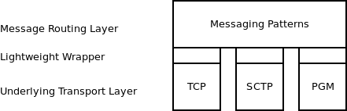

## Построение топологии vs. Маршрутизация сообщений

Каждый уровень сетевого стека скрывает (абстрагирует) часть сложности собственно сетевого обмена данными. Слой *IP* абстрагирует процесс поиска пути до удаленного хоста. *TCP* скрывает возможность потери данных при передаче по сети и предоставляет гарантии надежности.

ØMQ в свою очередь скрывает необходимость определять конкретное место в сети, куда необходимо отправить данные. Сообщения отправляются в топологию, а не на конкретный эндпоинт. Напомним, что топология связана с определенной бизнес-логикой, а значит отправляя сообщение в топологию вы фактически запрашиваете предоставление определенного сервиса, такого как изменение размера или яркости изображения. Конкретный эндпоинт прозрачным образом выбирается ØMQ.

Для продвижения этого принципа, ØMQ строго разделяет собственно методы построения топологии (*zmq_bind, zmq_connect*) и методы работы непосредственно с сообщениями (*zmq_send, zmq_recv*).

Первые работают непосредственно с сетевыми адресами используемыми транспортом, такими как IP адреса, в то время как вторые используют только хэндлеры (файловые дескрипторы) для обращения к конкретной топологии:

```cpp
/* Topology establishment */
int s = zmq_socket (...);
zmq_connect (s, "tcp://192.168.0.111:5555");

/* Message routing */
const char data [] = "ABC";
zmq_send (s, data, sizeof (data), 0);
```

Отделение построения топологии от маршрутизации сообщений строго говоря абсолютно необходимым. В конце концов, это может быть скомбинировано в одном вызове функции:

```cpp
zmq_send (s, "tcp://192.168.0.111:5555", data, sizeof (data), 0);
```

В пользу разделения одновременно есть технические и образовательные доводы. Технические аргументы включают в себя:
  * Для получения сообщений из топологии нам необходимо в любом случае соединение с ней. И нет причин также не использовать установленное соединение для отправки
  * Разделение построения топологии и маршрутизации сообщений хорошо ложится на BSD socket API (bind/connect vs. send/recv) (*в общем-то, не только BSD, прим. пер.*)

Образовательный аргумент даже более важен. Он касается того, чем является ØMQ, а чем нет.

Нижележащие протоколы, такие как TCP, позволяют отправлять сообщение на конкретный эндпоинт. ØMQ функционирует поверх этого протокола и позволяет отправлять сообщение в топологию, а не конкретному получателю. Таким образом, для отправки сообщения на конкретный эндпоинт следует использовать непосредственно TCP или аналог, а для топологии - ØMQ.

К сожалению, данная концепция тяжела для принятия: практически невозможно убедить людей не пытаться использовать ØMQ для работы с конкретными адресами, и что подобный дизайн - это не баг, а фича.

Разделение построения топологии и направления сообщений не решает этой проблемы, но делает данные особенности функциональности более очевидными. Добавление разрешения имен в будущем сделает это полностью понятным:

```cpp
zmq_connect (s, "Brightness-Adjustment-Service");
zmq_send (s, data, sizeof (data), 0);
```

## Шаблоны обмена данными с помощью сообщений ##

*Под __шаблонами__ в данном разделе следует понимать [архитектурный паттерн][MSGPATT], описывающий как 2 разных части системы обмена сообщениями соединяются и коммуницируют друг с другом (прим. пер.)*

При рассмотрении топологий в смысле маршрутизации сообщений, становится ясно, что алгоритмы маршрутизации для разных топологий различаются. В то время как топология "Котировки NASDAQ" предназначена для рассылки котировок всем потребителям, топология "Изменение яркости изображения" передает изображение одному из обработчиков, а результат обработки - обратно оригинальному отправителю. 

В ØMQ этот факт проявляется через так называемые *шаблоны обмена сообщениями*. Так первая топология (*котировок*) является примером шаблона *Издатель/Подписчик (Pub/Sub)*, а вторая - примером шаблона *Запрос/Ответ (Req/Rep)*.

Шаблон определяет как протокол, который используется для коммуникации между узлами, так и функционирование этих узлов, т.е. алгоритм который будет ими использоваться для маршрутизации сообщений. Следовательно, разные шаблоны ведут себя как разные протоколы. Вы не сможете присоединить узел Pub/Sub к узлу Req/Rep также, как, например, присоединить эндпоинт TCP к эндпоинту SCTP. Каждая топология таким образом реализует ровно один шаблон - и нет никакого способа использовать несколько шаблонов в пределах одной топологии.

Это строгое разделение необходимо для предоставления гарантий поведения топологии как единого целого. Так, пока мы уверены, что каждый узел топологии реализует семантику Pub/Sub, мы можем предоставлять гарантию *"Сообщение будет доставлено каждому узлу топологии"*. Мы бы не смогли утверждать такого, если, скажем, часть узлов вместо широковещательной рассылки занималась бы балансировкой нагрузки. И даже хуже: так как список возможных шаблонов является открытым, мы должны были бы исходить из того, что узлы ведут себя произвольным образом и не смогли бы дать **никаких гарантий** вообще.

Перед вами диаграмма сетевого стека. Обратите внимание, что отдельные шаблоны находятся на одном слое стека и не зависят друг от друга.

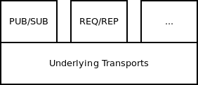

Некоторые традиционные системы обмена сообщениями сделали выбор в пользу предоставления общей инфраструктуры, позволяющей пользователю реализовать поверх нее произвольный алгоритм маршрутизации (как пример, *[AMQP][AMQP]* с её *exchanges, bindings* и *consumers*). Поэтому, видится важным дать обоснование для выбора в ØMQ готового ограниченного набора шаблонов.

**Во-первых**, проектирование полнофункционального и стабильного шаблона - сама по себе непростая задача. Перекладывая ответственность по созданию шаблона на пользователя мы в гарантируем, что большинство приложений построенные на нашей системе будут содержать те или иные ошибки. А там, где шаблоны будут реализованы корректно, стоимость обучения и разработки будет многократно превышать стоимость использования готовых шаблонов. В конце концов, как говорилось в одной из ранних статей, посвященных архитектуре *DNS*: "(пользователи) хотят использовать, а не понимать как устроены предоставляемые им системы"

**Во-вторых**, формально определенные шаблоны позволяют требовать использования только одного из них в пределах одной топологии. Система может проверить реализует ли узел конкретный шаблон, и ,если нет, отказать в соединении. Если же шаблон реализуется пользователем, проведение подобных проверок невозможно.

**В-третьих**, универсальная инфраструктура маршрутизации не может быть автоматически масштабирована (в смысле *[федерализована][FED]*). Она предназначена для работы в рамках одной *[hub-and-spoke][SPOKEHUB]* архитектуры, и, как только появится необходимость выйти за ее пределы, вам придется предоставлять дополнительную информацию, а именно ответ на вопрос *"что это за шаблон?"*. Посмотрите на механизмы федерализации, реализованные разными продуктами поверх AMQP. В них во всех присутствует флаг определяющий шаблон, явно или неявно (напр. путем поддержки только одного шаблона).

И наконец, наш опыт работы с AMQP показывает, что хотя этот стандарт предоставляет широкий простор для реализации возможных шаблонов, люди реализуют только пару из них снова и снова, полностью игнорируя остальную часть спектра.

## Прыг-скок или Из-конца-в-конец ##
(*идиотский перевод заголовка [Hop-by-Hop][HbH] vs. [End-to-End][E2E], лучше не придумал, прим. пер.*)

Одна из самых изобретательных особенностей сетевого стека Интернет - это прозрачное и понятное разделение функциональности *Hop-by-hop* (представлена протоколом IP) и функциональностью *End-to-end* (представлена TCP, UDP, SCTP, и т.д.). Это разделение позволило экосистеме поступательно развиваться. Если бы его не было, каждое минорное изменение в протоколах *End-to-end* было бы также болезненно, как и переход от IPv4 к IPv6.

Идея в том, что каждый из узлов сети должен поддерживать протокол IP, и **только** эндпоинты использующие специфический протокол, как TCP, должны озаботиться его поддержкой. Другими словами, промежуточным узлам, таким как маршрутизаторы, для того, чтобы работать ожидаемым образом, не нужно знать ничего об *end-to-end* протоколе, работающем поверх IP.

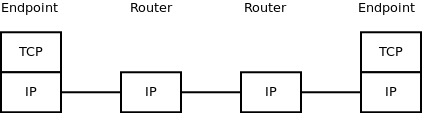

Опыт с разделением IP и TCP слоев был впоследствии обобщен в форме "end-to-end argument". Он гласит, что если функциональность не может быть должным образом реализована на нижнем слое (в нашем случае *hop-by-hop*), т.е. требует помощи верхнего слоя для того, чтобы работать ожидаемым образом, то вероятно не стоит реализовывать данную функциональность на нижнем уровне.

В ØMQ мы следуем описанному выше принципу и разделяем стек на слой *hop-by-hop* (имена типов сокетов начинаются с *"X"*) и слой *end-to-end* (имена типов сокетов не начинаются с *"X"*). Обратите внимание как похожа диаграмма на приведенную выше:

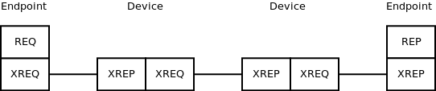

Аналогично стеку TCP/IP слой *hop-to-hop* ответственен за маршрутизацию,в то время как слой *end-to-end* может предоставлять дополнительные сервисы, такие как обеспечение надежности передачи данных, шифрование и т.д.

Тем не менее не стоит слишком сильно привязываться к метафоре TCP/IP. В отличие от стека сети Интернет с одним *hop-to-hop* протоколом, в ØMQ каждый *end-to-end* протокол соответствует своему *hop-to-hop* варианту. Получившийся стек выглядит примерно так:

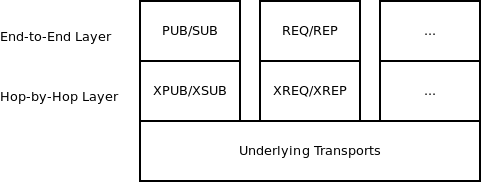

Такая конфигурация выбрана потому, логика маршрутизации (реализуемая *hop-to-hop* протоколом) специфична для каждого из шаблонов и потому не может переиспользоваться между ними. Тем не менее, если в будущем мы столкнемся с существованием двух шаблонов, которые переиспользуют один и тот же алгоритм маршрутизации и отличаются только *end-to-end* протоколом, то эта ситуация будет повторять ту, что есть в стеке протоколов сети Интернет.

Наконец, давайте рассмотрим конкретный пример разделения *hop-by-hop* и *end-to-end*.

Шаблон *Запрос/Ответ* предполагает доставку запроса от клиента одному из воркеров (экземпляров) приложения (с балансировкой нагрузки по пути), который в дальнейшем обрабатывает запрос и генерирует ответ. Ответ доставляется обратно тому же клиенту: 

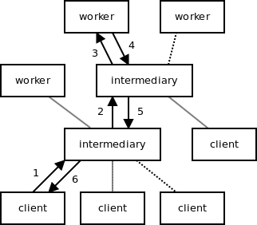

*Hop-by-hop* слой должен доставить каждый запрос к одному из узлов - обработчиков (балансировка нагрузки) и потом отправить ответ узлу - источнику соответствующего запроса.

Все работает хорошо до сбоя обработчика или возможного отключения целого участка топологии из-за сетевого сбоя. В этом случае клиент может навсегда зависнуть в состоянии ожидания ответа, которого никогда не будет.

Для решения этой проблемы клиент может ожидать ответа ограниченное время, и если по истечение его ответ не пришел - повторно отправлять запрос. Так же предполагается необходимость отсекать задержавшиеся по пути дубли ответов.

Вспомним *end-to-end argument*. Логика повторной отправки не может быть реализована без помощи эндпоинта, а значит нет особого смыла её реализовывать на уровне слоя *hop-by-hop* (кроме возможных оптимизаций, как сохранение на диск и повторная отправка после перезапуска узла после сбоя).

В результате мы получаем, что маршрутизация выполнена на слое *hop-by-hop*, а гарантии надежности реализованы в слое *end-to-end*

## Разрешение имен ##

В данный момент ØMQ не предоставляет имен сам по себе. Для присоединения к топологии вы должны использования адрес определенный нижележащим транспортом, таким как IP адрес и TCP порт.

Хотя в будущем, возможно стоит предоставлять сервис разрешения имен который бы имя топологии (*"ØMQ адрес"*) преобразовывал к транспортный адрес. Например, строка *"Brightness-Adjustment-Service"* разрешалась бы в *"tcp://192.168.0.1111:5555"*.

На момент написания статьи этой проблеме еще не было уделено достаточно внимания, но основным вопросом видится то, что топология состоит из многих узлов, а сервис должен выбрать только один из них. Критерий принятия решения может быть административным. Например, при подключении к топологии *"Котировки NASDAQ"*, вы бы хотели подключиться к локальному хабу котировок, а не к центральному узлу самой биржи или, тем более, к хабу конкурента.

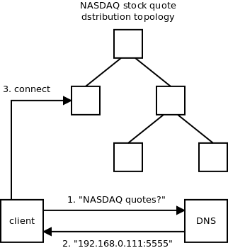

Технически, сервис разрешения имен должен быть реализован на DNS, как единственной распределенной базой данных доступной абсолютно везде. Более того, собственно для такого сервиса DNS и предназначена.

Тем не менее, архитектурные последствия хранения имен в такой слабо-консистентной распределенной базе как DNS должны быть учтены. Например, топологии должны быть долго живущими и редко изменяющимися сущностями, дабы быть уверенными, что механизме кеширования DNS не испортит само разрешение имен.

## Приложение: Архитектурные принципы ##

### Принцип единообразия ###

Принцип устанавливает, что должно быть неважно к какому узлу топологии вы подключаете ваше приложение - должен быть предоставлен одинаковый сервис.

Хотя звучит принцип вполне очевидно, его достаточно легко нарушить. Рассмотрим шаблон *Pub/Sub* таким, каким он реализован в данный момент в ØMQ. Он позволяет нескольким издателям в топологии нарушить принцип:

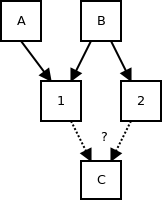

На данной диаграмме узел *C*, будет получать разные данные (только от *B* в одном случае и от *A+B* в другом) в зависимости от того, к какому промежуточному узлу он подключен. 

Обратите внимание, насколько важен этот принцип в архитектуре сети Интернет. Не важно к какой точке сети вы подключились, по проводу или wi-fi, через какого провайдера - взгляд на мир у вас всегда один. 

### Принцип масштабируемости ###

Принцип устанавливает, что когда топология не справляется с нагрузкой, по причине перегрузки узлов или соединений, должна быть возможность решить проблему путем путем добавления новых узлов в топологию. Более того, количество добавляемых узлов растет линейно с нагрузкой.

Давайте рассмотрим шаблон, нарушающий данный принцип. Простейший немасштабируемый шаблон состоит в разбиении приложения на фиксированное число функциональных блоков. Представьте себе монолитное приложение реализующее функционал бухгалтерии и HR. В момент, когда единое приложение перестает справляться с нагрузкой, программисты могут решить разделить его на два независимых в соответствии с их функционалом, так, чтобы запускать приложения отдельно:

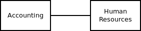

Эта архитектура не проходит тест на масштабируемость. Когда уже эти два приложения перестанут справляться с нагрузкой - не будет возможности добавить третий узел, не переписав само приложение.

**Замечание:** данный шаблон реализован в ØMQ сокетом *PAIR*.

Более сложный пример немасштабируемого шаблона - это распределенное логирование:

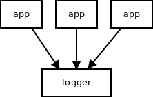

С ростом количества приложений нагрузка на сервис логирования растет, до момента пока он не перестанет справляться с нагрузкой. Добавление промежуточных узлов между приложениями и логером не решит проблему принципиально. Все приложения должны получить доступ к сервису, и не имеет значения что посредине - в какой-то точке произойдет сбой.

Чтобы сделать этот, своего рода шаблон *сбора данных* масштабируемым, промежуточные узлы должны агрегировать сообщения, т.е. отправлять в логгер фиксированное количество вне зависимости от количества приложений-пользователей логера. Агрегация может происходить в формах подсчета сумм, передачи статистики вместо самих сообщений и т.п. Подобный агрегирующий шаблон используется в шаблоне *Pub/Sub* для перенаправления подписок. Дабы не перегружать издателя валом подписок, они агрегируются на промежуточных узлах и далее отправляется только дельта (разница).

И снова обратите внимание как Интернет соответствует этому принципу.
Новые узлы могут быть добавлены в любой момент, будь это оконечные пользовательские устройства или промежуточная инфраструктура, без ухудшения функциональности или производительности сети в целом. 

### Принцип вставки ###

Принцип устанавливает, что вставка промежуточного узла в топологию не должна менять поведения эндпоинтов. (Заметьте, что вставка может быть использована для масштабирования топологии)

В качестве примера возьмем часто запрашиваемую возможность задания числа пиров, подключаемых к конкретному узлу. И определим следующую трансформацию, при которой узел *I* вставлен в топологию:

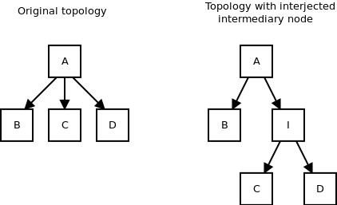

Как мы видим, поведение эндпоинта *A* изменяется со вставкой нового узла. Если он ранее направлял данные трем узлам, то теперь только двум. Таким образом, использование в логике количества узлов будет нарушать данный принцип.

И снова, данный принцип важен для построения сети Интернет. Действительно, если бы вставка промежуточного узла, например, роутера ломала бы логику приложений на конечных устройствах - Сеть очень быстро бы оказалась в неисправном состоянии.

## Заключение ##

Архитектура, описанная в статье, отражает текущую (на момент написания статьи) архитектуру ØMQ, с некоторыми исключениями, в данный момент нереализованными. Надеюсь, данная статья, предоставляя короткое введение в распределенные системы сообщений, сформирует базис для продолжения работы по этой теме.

[ORIG]: http://250bpm.com/concepts
[FPGA]: https://ru.wikipedia.org/wiki/FPGA "Программируемая пользователем вентильная матрица (ППВМ, англ. field-programmable gate array, FPGA)"
[INFINIBAND]: https://ru.wikipedia.org/wiki/InfiniBand "Infiniband (иногда сокр. IB) — высокоскоростная коммутируемая компьютерная сеть"
[SCTP]: https://ru.wikipedia.org/wiki/SCTP "SCTP (англ. Stream Control Transmission Protocol — «протокол передачи с управлением потоком»)"
[MULTIHOMING]: https://ru.wikipedia.org/wiki/%D0%9C%D0%BD%D0%BE%D0%B6%D0%B5%D1%81%D1%82%D0%B2%D0%B5%D0%BD%D0%BD%D0%B0%D1%8F_%D0%B0%D0%B4%D1%80%D0%B5%D1%81%D0%B0%D1%86%D0%B8%D1%8F "Множественная адресация"
[HEARTBEAT]: https://ru.wikipedia.org/wiki/Heartbeat-%D1%81%D0%BE%D0%BE%D0%B1%D1%89%D0%B5%D0%BD%D0%B8%D0%B5 "Heartbeat («сердцебиение»)"
[PGM]: https://ru.wikipedia.org/wiki/Pragmatic_General_Multicast "Pragmatic General Multicast (PGM)"
[FED]: https://en.wikipedia.org/wiki/Federated_architecture "Federated architecture"
[SPOKEHUB]: https://en.wikipedia.org/wiki/Spoke%E2%80%93hub_distribution_paradigm "Spoke-hub distribution paradigm"
[AMQP]: https://ru.wikipedia.org/wiki/AMQP "AMQP (Advanced Message Queuing Protocol)"
[MSGPATT]: https://en.wikipedia.org/wiki/Messaging_pattern "Messaging pattern"
[HbH]: https://en.wikipedia.org/wiki/Hop-by-hop_transport "Hop-by-hop transport"
[E2E]: https://en.wikipedia.org/wiki/End-to-end_principle "End-to-end principle"